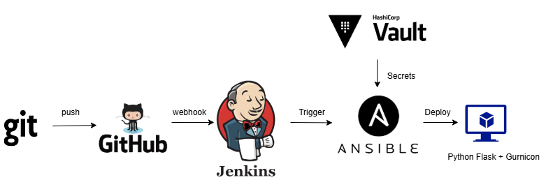

  
   
  <em>Figure 1: Pipeline Jenkin CI/CD</em>

# Web-Jenkins CI/CD Deployment with Nginx and HAProxy

This project automates the CI/CD pipeline for deploying a Python Flask web application using Jenkins. The setup includes Jenkins as the automation server, Nginx as a reverse proxy, and optionally HAProxy as a load balancer.

---

## First, clone the GitLab repository

You can get started by creating infrasucture follow link GitLab:
- **Repository**: [`https://gitlab.com/nvt18624-group/IaC.git`](https://gitlab.com/nvt18624-group/IaC.git)
- **Trigger Method**: follow this link and get README.md

# Web-Jenkins CI/CD Deployment app with Flask and connect to postgresql database over Nginx and HAProxy

This project automates the CI/CD pipeline for deploying a Python Flask web application using Jenkins. The setup includes Jenkins as the automation server, Nginx as a reverse proxy, and HAProxy as a load balancer (optional for scalability and fault tolerance). The deployment is managed using Ansible and Docker.

## Stack Used

- **Jenkins** - CI/CD automation server
- **Docker** - Containerized deployment of the Flask app
- **Ansible** - Automation and provisioning
- **Nginx** - Reverse proxy for serving the Flask app
- **HAProxy** - Load balancer (optional)
- **Flask** - Python web framework

## Required Credentials Configuration

Before running the pipeline, ensure the following credentials are configured in your CI/CD platform (e.g., **Jenkins** > *Manage Credentials*):

| Credential ID     | Type                          | Description                                     |
|-------------------|-------------------------------|-------------------------------------------------|
| `VAULT_ADDR`      | Secret Text                   | Vault address of the secret manager             |
| `VAULT_ROLE_ID`   | Secret Text                   | Role ID used for Vault AppRole authentication   |
| `VAULT_SECRET_ID` | Secret Text                   | Secret ID used for Vault AppRole authentication |
| `GG_CLOUD_PRIVATE`| SSH Username with Private Key | SSH private key for Ansible and Google Cloud    |
| `SSH_CONFIG`      | Secret File                   | SSH config file (`config_ssh.txt`)              |
| `SERVER1`         | Secret Text                   | IP or domain of the first web server            |
| `SERVER2`         | Secret Text                   | IP or domain of the second web server           |

> **Make sure all credentials are stored securely and have appropriate access restrictions.**

---

